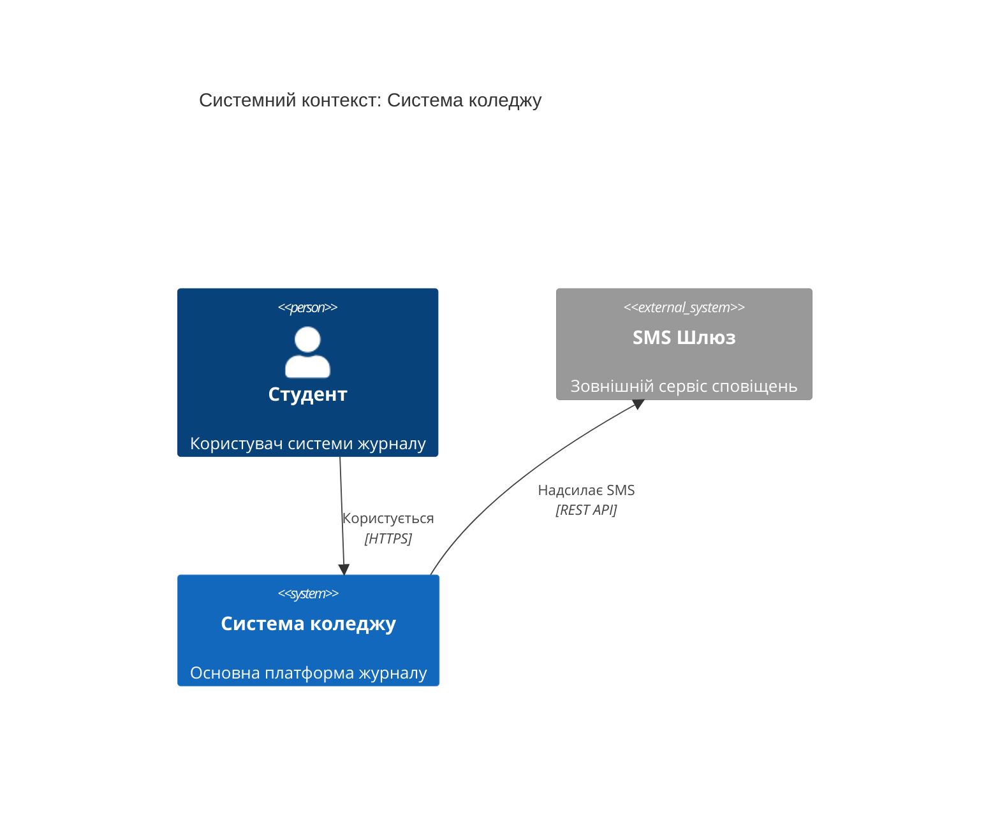
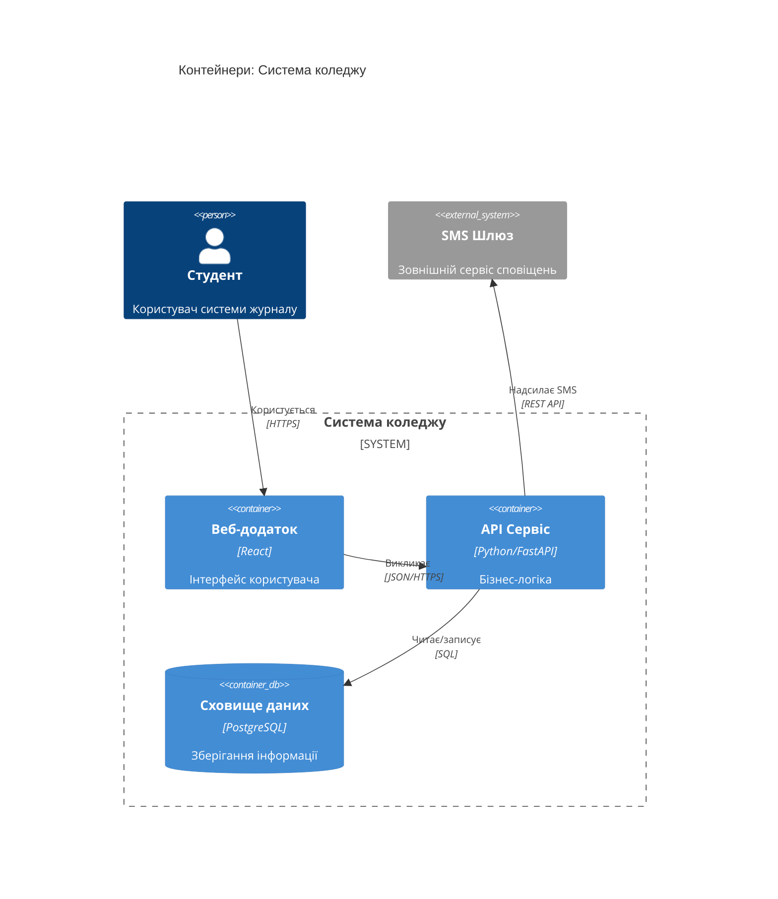

## Системний контекст

<!-- diagram:context -->

```mermaid
C4Context
title Системний контекст: Система коледжу
Person(user, "Студент", "Користувач системи журналу")
System_Ext(ext_sms, "SMS Шлюз", "Зовнішній сервіс сповіщень")
System(college_sys, "Система коледжу", "Основна платформа журналу")
Rel(user, college_sys, "Користується", "HTTPS")
Rel(college_sys, ext_sms, "Надсилає SMS", "REST API")
```

<!-- /diagram:context -->

<!-- diagram:containers -->

```mermaid
C4Container
title Контейнери: Система коледжу
Person(user, "Студент", "Користувач системи журналу")
System_Ext(ext_sms, "SMS Шлюз", "Зовнішній сервіс сповіщень")
System_Boundary(college_sys, "Система коледжу") {
    Container(web, "Веб-додаток", "React", "Інтерфейс користувача")
    Container(api, "API Сервіс", "Python/FastAPI", "Бізнес-логіка")
    ContainerDb(db, "Сховище даних", "PostgreSQL", "Зберігання інформації")
}
Rel(user, web, "Користується", "HTTPS")
Rel(web, api, "Викликає", "JSON/HTTPS")
Rel(api, db, "Читає/записує", "SQL")
Rel(api, ext_sms, "Надсилає SMS", "REST API")
```
<!-- /diagram:containers -->